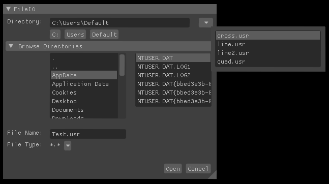

# Imgui-IGS-Snippets
Imgui code exchanges for convenience at IGS 

## FileIO Dialogue
 * similar to the standard windows file-io
 * additional recent file drop down
 * additional subdirectory buttons (linux style)
 
 

## About Dialoge
 * text
 * close button
 * animated IGS logo
 
 